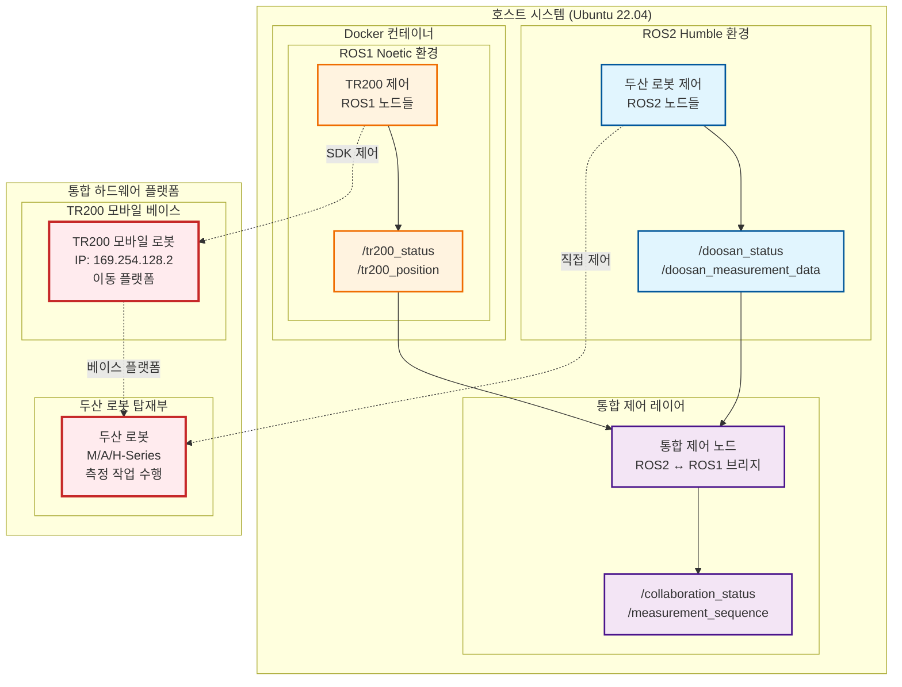
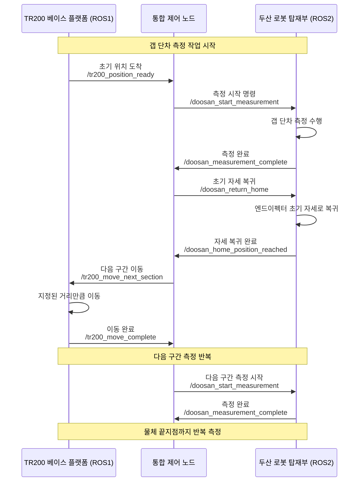
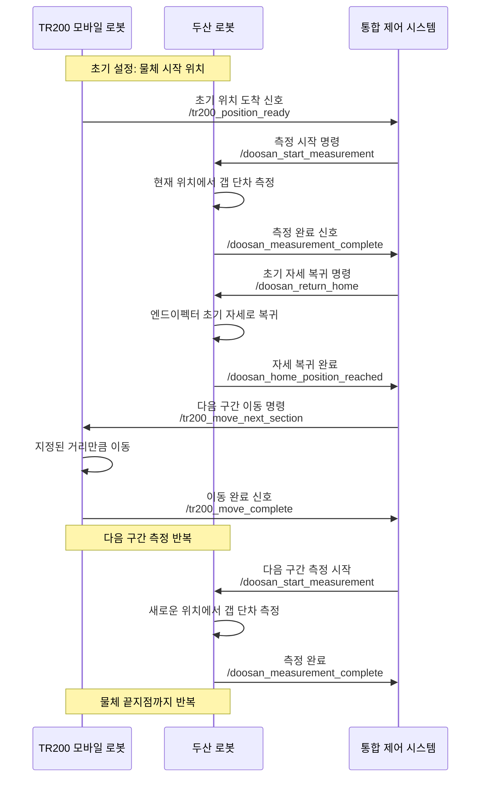

# Mobile Manipulator 통합 제어 워크스페이스

## 📋 프로젝트 개요

이 워크스페이스는 **하나의 노트북에서 두 개의 서로 다른 ROS 환경을 동시에 제어**하는 통합 시스템입니다:

- **두산 로봇 (Doosan Robotics)**: Ubuntu 22.04 + ROS2 Humble 환경에서 직접 제어
- **TR200 모바일 로봇**: Docker 컨테이너 내 Ubuntu 20.04 + ROS1 Noetic 환경에서 제어

**최종 목표**: 두 로봇이 토픽 통신을 통해 서로의 상태를 모니터링하며 협업 작업을 수행하는 시스템 구축

## 🏗️ 시스템 아키텍처

### 하이브리드 ROS 환경 구조 (TR200 + 두산 로봇 통합 시스템)



## 📁 워크스페이스 구조

```
mobile_manipulator_ws/
├── README.md                           # 이 파일
├── doosan_ws/                          # 두산 로봇 ROS2 워크스페이스
│   ├── src/doosan-robot2/              # 두산 로봇 공식 패키지들
│   │   ├── dsr_common2/                # 공통 라이브러리 및 유틸리티
│   │   ├── dsr_controller2/            # 로봇 제어기 (ROS2 Control)
│   │   ├── dsr_description2/           # 로봇 모델 및 URDF
│   │   ├── dsr_hardware2/              # 하드웨어 인터페이스
│   │   ├── dsr_msgs2/                  # 커스텀 메시지 및 서비스
│   │   ├── dsr_bringup2/               # 런치 파일 및 설정
│   │   ├── dsr_gazebo2/                # Gazebo 시뮬레이션
│   │   ├── dsr_moveit2/                # MoveIt 설정 (다양한 모델)
│   │   ├── dsr_example2/               # 예제 코드
│   │   └── dsr_mujoco/                 # MuJoCo 시뮬레이션
│   ├── build/                          # 빌드 결과물
│   ├── install/                        # 설치된 패키지들
│   └── log/                            # 빌드 로그
│
└── tr200_ros_docker_project/           # TR200 Docker 프로젝트
    ├── README.md                       # TR200 프로젝트 문서
    ├── TR200_ROS_PROJECT_PLAN.md       # 개발 계획서
    ├── docker/                         # Docker 환경 설정
    │   ├── Dockerfile                  # ROS1 Noetic 컨테이너 정의
    │   ├── docker-compose.yml          # 컨테이너 오케스트레이션
    │   └── entrypoint.sh               # 컨테이너 시작 스크립트
    ├── src/                            # ROS1 패키지들
    │   ├── tr200_ros_control/          # 원격 제어 패키지
    │   │   ├── launch/                 # 런치 파일들
    │   │   ├── scripts/                # Python 제어 노드들
    │   │   ├── config/                 # 설정 파일들
    │   │   ├── msg/                    # 커스텀 메시지
    │   │   └── srv/                    # 커스텀 서비스
    │   ├── tr200_simple_control/        # 자동 제어 패키지
    │   │   ├── launch/                 # 센서 기반 안전 제어
    │   │   ├── scripts/                # 안전 제어 노드들
    │   │   └── config/                 # 안전 파라미터 설정
    │   └── woosh_robot_py/             # Woosh SDK (TR200 제어)
    ├── scripts/                        # 실행 스크립트들
    │   ├── build_docker.sh             # Docker 이미지 빌드
    │   ├── run_container.sh            # 컨테이너 실행
    │   ├── connect_container.sh        # 추가 터미널 접속
    │   └── setup_ros.sh                # ROS 환경 설정
    └── launch/                         # 통합 런치 파일들
```

## 🎯 각 시스템의 역할

### 통합 모바일 매니퓰레이터 시스템

**전체 구성**: TR200 모바일 베이스 + 두산 로봇 탑재부
- **TR200 모바일 베이스**: 두산 로봇을 탑재한 이동 플랫폼
- **두산 로봇 탑재부**: 정밀 측정 작업을 수행하는 매니퓰레이터

### 두산 로봇 시스템 (ROS2 Humble) - 탑재부

**목적**: 정밀한 갭 단차 측정 작업 수행
- **지원 모델**: M, A, H-Series (다양한 모델별 설정 제공)
- **주요 기능**:
  - 갭 단차 측정 센서 제어
  - 측정 데이터 수집 및 처리
  - 안전한 초기 자세 복귀
  - 측정 품질 관리

**핵심 패키지**:
- `dsr_controller2`: ROS2 Control 기반 실시간 제어
- `dsr_moveit2`: MoveIt 설정 (모델별 최적화)
- `dsr_msgs2`: 129개 서비스, 18개 메시지 정의
- `dsr_description2`: URDF 모델 및 메시 파일

### TR200 모바일 로봇 시스템 (ROS1 Noetic) - 베이스 플랫폼

**목적**: 측정 대상물을 따라 이동하며 측정 구간 제공
- **네트워크**: IP 169.254.128.2, Port 5480
- **주요 기능**:
  - 정밀한 구간별 이동 제어
  - 측정 위치 정확도 보장
  - 듀얼 라이다 센서 기반 안전 제어
  - Docker 기반 격리된 환경

**핵심 패키지**:
- `tr200_ros_control`: 키보드 원격 제어 시스템
- `tr200_simple_control`: 센서 기반 자동 안전 제어
- `woosh_robot_py`: TR200 전용 SDK

## 🔄 통신 아키텍처

### ROS2 ↔ ROS1 브리지 통신 (갭 단차 측정 시나리오)



### 토픽 통신 구조 (갭 단차 측정용)

#### TR200 베이스 플랫폼 → 통합 제어
- `/tr200_position_ready`: 초기 위치 도착 신호
- `/tr200_move_complete`: 구간 이동 완료 신호
- `/tr200_position`: 현재 위치 정보 (x, y, theta)
- `/tr200_status`: 베이스 플랫폼 상태 (이동 중/대기/오류)

#### 두산 로봇 탑재부 → 통합 제어
- `/doosan_measurement_complete`: 측정 완료 신호
- `/doosan_home_position_reached`: 초기 자세 복귀 완료
- `/doosan_measurement_data`: 측정 데이터 (갭 단차 값, 위치 정보)
- `/doosan_status`: 탑재부 상태 (측정 중/대기/오류)

#### 통합 제어 → 각 로봇
- `/doosan_start_measurement`: 측정 시작 명령
- `/doosan_return_home`: 초기 자세 복귀 명령
- `/tr200_move_next_section`: 다음 구간 이동 명령 (이동 거리 포함)
- `/collaboration_status`: 전체 협업 상태 및 진행률

## 🚀 사용 방법

### 1. 환경 설정

#### 두산 로봇 워크스페이스 빌드
```bash
cd /home/ldj/mobile_manipulator_ws/doosan_ws
colcon build --symlink-install
source install/setup.bash
```

#### TR200 Docker 환경 설정
```bash
cd /home/ldj/mobile_manipulator_ws/tr200_ros_docker_project
# 초기 컨테이너 진입
./scripts/run_container.sh

# 새로운 터미널에서 실행되고 있는 컨테이너 진입
./scripts/connect_container.sh
```

### 2. 개별 시스템 실행

#### 두산 로봇 제어 (ROS2)
```bash
# 시뮬레이션 환경에서 실행
ros2 launch dsr_bringup2 dsr_bringup2_gazebo.launch.py

# MoveIt과 함께 실행
ros2 launch dsr_bringup2 dsr_bringup2_moveit.launch.py

# 실제 로봇 제어 (하드웨어 연결 시)
ros2 launch dsr_controller2 dsr_control2.launch.py
```

#### TR200 제어 (ROS1 Docker)
```bash
# Docker 컨테이너 내부에서
roslaunch tr200_ros_control tr200_remote_control.launch

# 또는 센서 기반 자동 제어
roslaunch tr200_simple_control tr200_sensor_safety_controller.launch
```

### 3. 통합 제어 실행 (향후 구현)

```bash
# 통합 제어 시스템 실행
ros2 launch mobile_manipulator_integration integrated_control.launch.py

# 협업 작업 시퀀스 실행
ros2 run mobile_manipulator_integration collaboration_manager
```

## 🔧 개발 환경 요구사항

### 호스트 시스템
- **OS**: Ubuntu 22.04 LTS
- **ROS**: ROS2 Humble Hawksbill
- **Docker**: Docker Engine 20.10+
- **Python**: Python 3.10+

### Docker 컨테이너
- **OS**: Ubuntu 20.04 LTS
- **ROS**: ROS1 Noetic Ninjemys
- **Python**: Python 3.8+

### 하드웨어 요구사항
- **두산 로봇**: M/A/H-Series 중 하나
- **TR200 로봇**: IP 169.254.128.2로 접근 가능
- **네트워크**: 로봇들과 통신 가능한 네트워크 환경

## 📊 현재 구현 상태

### ✅ 완료된 기능

#### 두산 로봇 시스템
- [x] ROS2 Humble 환경 구축
- [x] 다양한 모델 지원 (M, A, H-Series)
- [x] MoveIt 통합 및 경로 계획
- [x] Gazebo/MuJoCo 시뮬레이션
- [x] 실시간 제어 시스템

#### TR200 시스템
- [x] Docker 기반 ROS1 Noetic 환경
- [x] 키보드 원격 제어 시스템
- [x] 센서 기반 안전 제어
- [x] 듀얼 라이다 센서 활용
- [x] Woosh SDK 통합

### 🔄 진행 중인 작업
- [ ] ROS2 ↔ ROS1 브리지 노드 개발
- [ ] 통합 제어 시스템 설계
- [ ] 협업 작업 시퀀스 정의

### 📋 향후 계획
- [ ] 통합 런치 파일 개발
- [ ] 협업 작업 시퀀스 구현
- [ ] 실시간 상태 모니터링 시스템
- [ ] 웹 기반 모니터링 인터페이스
- [ ] 다중 로봇 협업 알고리즘

## 🎯 협업 작업 시나리오: 가로 긴 물체 갭 단차 측정

### 시스템 구성
- **TR200 모바일 로봇**: 두산 로봇을 탑재한 이동 플랫폼 역할
- **두산 로봇**: TR200 위에 고정된 상태에서 정밀 측정 작업 수행
- **목적**: 가로가 긴 물체의 갭 단차를 구간별로 연속 측정

### 측정 작업 시퀀스



### 상세 작업 단계

#### 1단계: 초기 설정 및 위치 이동
1. **TR200**: 물체의 시작 위치로 이동
2. **TR200**: 초기 위치 도착을 통합 제어 시스템에 알림
3. **통합 제어**: 두산 로봇에게 측정 시작 명령 전송

#### 2단계: 갭 단차 측정
1. **두산 로봇**: 현재 위치에서 물체의 갭 단차 측정
2. **두산 로봇**: 측정 데이터 저장 및 처리
3. **두산 로봇**: 측정 완료 신호를 통합 제어 시스템에 전송

#### 3단계: 자세 복귀 및 이동 준비
1. **통합 제어**: 두산 로봇에게 초기 자세 복귀 명령 전송
2. **두산 로봇**: 엔드이펙터를 안전한 초기 자세로 복귀
3. **두산 로봇**: 자세 복귀 완료 신호 전송

#### 4단계: 다음 구간 이동
1. **통합 제어**: TR200에게 다음 구간 이동 명령 전송
2. **TR200**: 지정된 거리만큼 물체를 따라 이동
3. **TR200**: 이동 완료 신호 전송

#### 5단계: 반복 측정
1. **통합 제어**: 다음 구간 측정 시작 명령 전송
2. **두산 로봇**: 새로운 위치에서 갭 단차 측정 수행
3. **전체 과정 반복**: 물체의 끝지점까지 연속 측정

### 토픽 통신 구조

#### TR200 → 통합 제어
- `/tr200_position_ready`: 초기 위치 도착 신호
- `/tr200_move_complete`: 구간 이동 완료 신호
- `/tr200_position`: 현재 위치 정보
- `/tr200_status`: 로봇 상태 (이동 중/대기/오류)

#### 두산 로봇 → 통합 제어
- `/doosan_measurement_complete`: 측정 완료 신호
- `/doosan_home_position_reached`: 초기 자세 복귀 완료
- `/doosan_measurement_data`: 측정 데이터 (갭 단차 값)
- `/doosan_status`: 로봇 상태 (측정 중/대기/오류)

#### 통합 제어 → 각 로봇
- `/doosan_start_measurement`: 측정 시작 명령
- `/doosan_return_home`: 초기 자세 복귀 명령
- `/tr200_move_next_section`: 다음 구간 이동 명령
- `/collaboration_status`: 전체 협업 상태

### 측정 데이터 관리
- **측정 구간**: 물체 길이에 따른 구간별 분할
- **데이터 저장**: 각 구간별 갭 단차 측정값 저장
- **품질 관리**: 측정 정확도 검증 및 재측정 로직
- **결과 통합**: 전체 물체의 갭 단차 프로파일 생성

## 🔍 모니터링 및 디버깅

### ROS2 환경 모니터링
```bash
# 두산 로봇 상태 확인
ros2 topic echo /dsr_status
ros2 service list | grep dsr

# MoveIt 상태 확인
ros2 topic echo /move_group/status
```

### ROS1 환경 모니터링 (Docker 내부)
```bash
# TR200 상태 확인
rostopic echo /robot_status
rostopic echo /connection_status

# 센서 데이터 확인
rostopic echo /scan
rostopic echo /safety_status
```

## 📞 지원 및 문의

- **개발자**: ldj (KATECH 연구원)
- **프로젝트 시작**: 2025년 9월
- **문서 업데이트**: 2025년 10월 1일

### 주요 참고 자료
- [두산 로봇 ROS2 패키지 문서](doosan_ws/src/doosan-robot2/README.md)
- [TR200 ROS 프로젝트 계획서](tr200_ros_docker_project/TR200_ROS_PROJECT_PLAN.md)
- [TR200 사용자 가이드](tr200_ros_docker_project/README.md)

---

**이 워크스페이스는 두 개의 서로 다른 ROS 환경을 통합하여 협업 로봇 시스템을 구축하는 것을 목표로 합니다. 각 시스템의 독립성을 유지하면서도 효율적인 통신을 통해 복합적인 작업을 수행할 수 있는 플랫폼을 제공합니다.**
