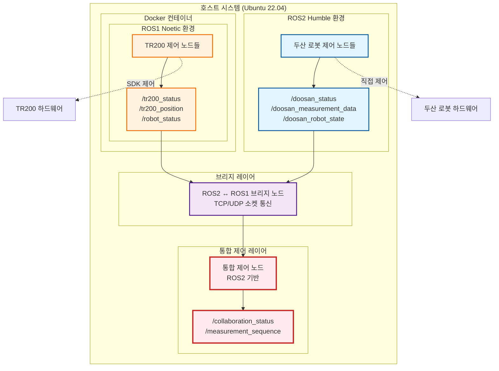
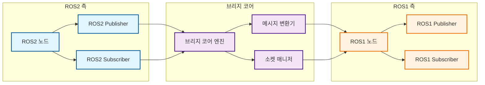

# 🔗 ROS2 ↔ ROS1 브리지 통신 시스템 명세서

## 📋 문서 개요

**문서명**: ROS2 ↔ ROS1 브리지 통신 시스템 명세서  
**버전**: 1.0  
**작성일**: 2025년 10월 1일  
**작성자**: ldj (KATECH 연구원)  
**목적**: 두산 로봇(ROS2)과 TR200 모바일 로봇(ROS1) 간 통신을 위한 브리지 시스템 설계 및 구현 명세

---

## 🎯 시스템 개요

### 프로젝트 목표
- **두산 로봇 (ROS2 Humble)**: Ubuntu 22.04 환경에서 직접 제어
- **TR200 모바일 로봇 (ROS1 Noetic)**: Docker 컨테이너 내 Ubuntu 20.04 환경에서 제어
- **통합 목표**: 두 로봇 간 실시간 토픽 통신을 통한 협업 작업 수행

### 핵심 요구사항
1. **실시간 통신**: 지연 시간 < 100ms
2. **안정성**: 메시지 손실률 < 0.1%
3. **확장성**: 향후 추가 로봇 지원 가능
4. **호환성**: 기존 ROS1/ROS2 노드와 무호환성

---

## 🏗️ 시스템 아키텍처

### 전체 통신 구조



### 브리지 노드 상세 구조



---

## 📡 토픽 통신 명세

### 토픽 매핑 테이블

| ROS2 토픽 | ROS1 토픽 | 메시지 타입 | 방향 | 주기 | 용도 |
|-----------|-----------|-------------|------|------|------|
| `/doosan_status` | `/doosan_status` | `std_msgs/String` | 양방향 | 10Hz | 두산 로봇 상태 |
| `/doosan_measurement_data` | `/doosan_measurement_data` | `std_msgs/Float64MultiArray` | ROS2→ROS1 | 이벤트 | 측정 데이터 |
| `/doosan_robot_state` | `/doosan_robot_state` | `dsr_msgs2/RobotState` | ROS2→ROS1 | 50Hz | 로봇 실시간 상태 |
| `/tr200_status` | `/tr200_status` | `tr200_ros_control/RobotStatus` | ROS1→ROS2 | 10Hz | TR200 상태 |
| `/tr200_position` | `/tr200_position` | `geometry_msgs/Pose2D` | ROS1→ROS2 | 20Hz | TR200 위치 |
| `/tr200_position_ready` | `/tr200_position_ready` | `std_msgs/Bool` | ROS1→ROS2 | 이벤트 | 위치 도착 신호 |
| `/tr200_move_complete` | `/tr200_move_complete` | `std_msgs/Bool` | ROS1→ROS2 | 이벤트 | 이동 완료 신호 |
| `/doosan_start_measurement` | `/doosan_start_measurement` | `std_msgs/Bool` | ROS2→ROS1 | 이벤트 | 측정 시작 명령 |
| `/doosan_return_home` | `/doosan_return_home` | `std_msgs/Bool` | ROS2→ROS1 | 이벤트 | 초기 자세 복귀 |
| `/tr200_move_next_section` | `/tr200_move_next_section` | `std_msgs/Float64` | ROS2→ROS1 | 이벤트 | 다음 구간 이동 |

### 협업 작업 시퀀스 토픽

| 토픽명 | 메시지 타입 | 방향 | 용도 |
|--------|-------------|------|------|
| `/collaboration_status` | `std_msgs/String` | 양방향 | 협업 상태 관리 |
| `/measurement_sequence` | `std_msgs/UInt32` | ROS2→ROS1 | 측정 시퀀스 번호 |
| `/emergency_stop` | `std_msgs/Bool` | 양방향 | 비상 정지 신호 |

---

## 🔧 기술적 구현 명세

### 브리지 노드 구현 방식

#### 1. 아키텍처 선택
- **방식**: ROS2 노드 기반 브리지 + TCP 소켓 통신
- **이유**: 
  - ROS1_bridge 패키지의 복잡성 회피
  - 커스텀 메시지 타입 지원
  - 실시간 성능 최적화 가능

#### 2. 통신 프로토콜
```python
# TCP 소켓 기반 통신 프로토콜
class BridgeProtocol:
    def __init__(self):
        self.header_size = 8  # 헤더 크기 (바이트)
        self.max_message_size = 1024  # 최대 메시지 크기
    
    def encode_message(self, topic_name, message_data):
        """메시지 인코딩"""
        # 헤더: [토픽명 길이(4바이트)] + [메시지 크기(4바이트)]
        # 바디: [토픽명] + [메시지 데이터]
        pass
    
    def decode_message(self, raw_data):
        """메시지 디코딩"""
        pass
```

#### 3. 메시지 변환 로직
```python
class MessageConverter:
    def __init__(self):
        self.conversion_map = {
            'std_msgs/String': self.convert_string,
            'std_msgs/Bool': self.convert_bool,
            'std_msgs/Float64': self.convert_float64,
            'geometry_msgs/Pose2D': self.convert_pose2d,
            'dsr_msgs2/RobotState': self.convert_robot_state,
            'tr200_ros_control/RobotStatus': self.convert_robot_status
        }
    
    def convert_message(self, ros_version, msg_type, data):
        """메시지 타입별 변환"""
        converter = self.conversion_map.get(msg_type)
        if converter:
            return converter(ros_version, data)
        return None
```

### 소켓 통신 명세

#### TCP 연결 설정
- **포트**: 8888 (기본값, 설정 가능)
- **프로토콜**: TCP (신뢰성 보장)
- **버퍼 크기**: 4096 바이트
- **타임아웃**: 5초

#### 연결 관리
```python
class SocketManager:
    def __init__(self, port=8888):
        self.port = port
        self.server_socket = None
        self.client_socket = None
        self.connection_status = False
    
    def start_server(self):
        """ROS2 측 서버 시작"""
        pass
    
    def connect_to_server(self):
        """ROS1 측 클라이언트 연결"""
        pass
    
    def send_message(self, topic_name, message_data):
        """메시지 전송"""
        pass
    
    def receive_message(self):
        """메시지 수신"""
        pass
```

---

## 📊 메시지 타입 정의

### 표준 메시지 타입

#### 1. 상태 메시지
```python
# ROS2: std_msgs/String
# ROS1: std_msgs/String
class StatusMessage:
    def __init__(self, status_text):
        self.data = status_text  # 상태 문자열
```

#### 2. 위치 메시지
```python
# ROS2: geometry_msgs/Pose2D
# ROS1: geometry_msgs/Pose2D
class PositionMessage:
    def __init__(self, x, y, theta):
        self.x = x      # X 좌표 (미터)
        self.y = y      # Y 좌표 (미터)
        self.theta = theta  # 회전각 (라디안)
```

#### 3. 측정 데이터 메시지
```python
# ROS2: std_msgs/Float64MultiArray
# ROS1: std_msgs/Float64MultiArray
class MeasurementDataMessage:
    def __init__(self, gap_values, position_info):
        self.data = gap_values + position_info  # 갭 단차 + 위치 정보
```

### 커스텀 메시지 타입

#### 1. 두산 로봇 상태 (ROS2 → ROS1)
```python
# ROS2: dsr_msgs2/RobotState
# ROS1: 변환된 std_msgs/String (JSON 형태)
class DoosanRobotState:
    def __init__(self, robot_state, current_posj, current_posx):
        self.robot_state = robot_state      # 로봇 상태 코드
        self.current_posj = current_posj    # 현재 관절 위치
        self.current_posx = current_posx     # 현재 작업 공간 위치
```

#### 2. TR200 로봇 상태 (ROS1 → ROS2)
```python
# ROS1: tr200_ros_control/RobotStatus
# ROS2: 변환된 std_msgs/String (JSON 형태)
class TR200RobotStatus:
    def __init__(self, connected, pose, battery_level):
        self.connected = connected          # 연결 상태
        self.pose = pose                    # 현재 위치
        self.battery_level = battery_level  # 배터리 잔량
```

---

## 🚀 구현 계획

### Phase 1: 기본 브리지 노드 구현 (3-5일)

#### 1단계: 패키지 생성 및 기본 구조
```bash
# 브리지 패키지 생성
cd /home/ldj/mobile_manipulator_ws/doosan_ws/src
ros2 pkg create --build-type ament_python ros1_ros2_bridge
```

#### 2단계: 핵심 클래스 구현
- `BridgeNode`: 메인 브리지 노드
- `SocketManager`: 소켓 통신 관리
- `MessageConverter`: 메시지 변환
- `TopicMapper`: 토픽 매핑 관리

#### 3단계: 기본 통신 테스트
- 단방향 통신 테스트
- 양방향 통신 테스트
- 메시지 손실률 측정

### Phase 2: 고급 기능 구현 (2-3일)

#### 1단계: 에러 처리 및 복구
- 연결 끊김 감지 및 재연결
- 메시지 손실 감지 및 재전송
- 타임아웃 처리

#### 2단계: 성능 최적화
- 메시지 압축
- 배치 처리
- QoS 설정

#### 3단계: 모니터링 및 로깅
- 통신 상태 모니터링
- 성능 메트릭 수집
- 디버그 로깅

---

## 🔧 설정 및 구성

### 환경 변수 설정
```bash
# 브리지 노드 설정
export BRIDGE_PORT=8888
export BRIDGE_TIMEOUT=5.0
export BRIDGE_BUFFER_SIZE=4096
export BRIDGE_LOG_LEVEL=INFO
```

### 런치 파일 구성
```python
# bridge_launch.py
def generate_launch_description():
    return LaunchDescription([
        Node(
            package='ros1_ros2_bridge',
            executable='bridge_node',
            name='ros1_ros2_bridge',
            parameters=[{
                'bridge_port': 8888,
                'bridge_timeout': 5.0,
                'bridge_buffer_size': 4096,
                'log_level': 'INFO'
            }],
            output='screen'
        )
    ])
```

### 파라미터 설정 파일
```yaml
# bridge_params.yaml
bridge:
  port: 8888
  timeout: 5.0
  buffer_size: 4096
  log_level: "INFO"
  
topics:
  ros2_to_ros1:
    - "/doosan_status"
    - "/doosan_measurement_data"
    - "/doosan_robot_state"
  
  ros1_to_ros2:
    - "/tr200_status"
    - "/tr200_position"
    - "/tr200_position_ready"
    - "/tr200_move_complete"
```

---

## 🧪 테스트 시나리오

### 단위 테스트
1. **메시지 변환 테스트**
   - 각 메시지 타입별 변환 정확성 검증
   - 데이터 손실 없음 확인

2. **소켓 통신 테스트**
   - 연결/해제 테스트
   - 메시지 전송/수신 테스트
   - 네트워크 오류 시나리오 테스트

3. **브리지 노드 테스트**
   - 토픽 구독/발행 테스트
   - 동시 다중 토픽 처리 테스트

### 통합 테스트
1. **기본 통신 테스트**
   - ROS2 → ROS1 방향 통신
   - ROS1 → ROS2 방향 통신
   - 양방향 동시 통신

2. **성능 테스트**
   - 지연 시간 측정 (< 100ms 목표)
   - 처리량 측정 (1000 msg/s 목표)
   - 메모리 사용량 모니터링

3. **안정성 테스트**
   - 장시간 운영 테스트 (24시간)
   - 연결 끊김 복구 테스트
   - 메시지 손실률 측정 (< 0.1% 목표)

### 시나리오 테스트
1. **협업 작업 시뮬레이션**
   - 갭 단차 측정 시퀀스 테스트
   - 로봇 간 동기화 테스트
   - 오류 상황 대응 테스트

---

## 📈 성능 요구사항

### 응답 시간
- **일반 메시지**: < 50ms
- **긴급 메시지**: < 10ms
- **대용량 메시지**: < 100ms

### 처리량
- **초당 메시지 수**: > 1000 msg/s
- **동시 토픽 수**: > 20개
- **메시지 크기**: < 1MB

### 안정성
- **메시지 손실률**: < 0.1%
- **연결 안정성**: > 99.9%
- **복구 시간**: < 5초

### 리소스 사용량
- **CPU 사용률**: < 10%
- **메모리 사용량**: < 100MB
- **네트워크 대역폭**: < 10Mbps

---

## 🔍 모니터링 및 디버깅

### 로깅 시스템
```python
class BridgeLogger:
    def __init__(self, log_level='INFO'):
        self.logger = logging.getLogger('ros1_ros2_bridge')
        self.setup_logging(log_level)
    
    def log_communication(self, direction, topic, message_size):
        """통신 로그 기록"""
        pass
    
    def log_error(self, error_type, error_message):
        """에러 로그 기록"""
        pass
    
    def log_performance(self, metrics):
        """성능 메트릭 로그 기록"""
        pass
```

### 모니터링 도구
- **ros2 topic echo**: 토픽 모니터링
- **ros2 node list**: 노드 상태 확인
- **htop**: 시스템 리소스 모니터링
- **netstat**: 네트워크 연결 상태 확인

### 디버깅 명령어
```bash
# 브리지 노드 상태 확인
ros2 node info /ros1_ros2_bridge

# 토픽 통신 모니터링
ros2 topic echo /doosan_status
ros2 topic echo /tr200_status

# 네트워크 연결 확인
netstat -an | grep 8888

# 로그 확인
ros2 log level /ros1_ros2_bridge DEBUG
```

---

## 📋 체크리스트

### 개발 체크리스트
- [ ] 브리지 패키지 생성
- [ ] 기본 브리지 노드 클래스 구현
- [ ] 소켓 통신 매니저 구현
- [ ] 메시지 변환기 구현
- [ ] 토픽 매핑 시스템 구현
- [ ] 에러 처리 로직 추가
- [ ] 로깅 시스템 구현
- [ ] 설정 파일 구현
- [ ] 런치 파일 구현

### 테스트 체크리스트
- [ ] 단위 테스트 작성
- [ ] 통합 테스트 시나리오 작성
- [ ] 성능 테스트 수행
- [ ] 안정성 테스트 수행
- [ ] 시나리오 테스트 수행
- [ ] 문서화 완료

### 배포 체크리스트
- [ ] 패키지 빌드 및 설치
- [ ] 런치 파일 테스트
- [ ] 실제 로봇과 연동 테스트
- [ ] 성능 최적화 완료
- [ ] 사용자 가이드 작성

---

## 📞 지원 및 문의

- **개발자**: ldj (KATECH 연구원)
- **프로젝트**: Mobile Manipulator 통합 제어 시스템
- **문서 버전**: 1.0
- **최종 업데이트**: 2025년 10월 1일

### 참고 자료
- [ROS1-ROS2 브리지 공식 문서](https://github.com/ros2/ros1_bridge)
- [두산 로봇 ROS2 패키지](doosan_ws/src/doosan-robot2/)
- [TR200 ROS 프로젝트](tr200_ros_docker_project/)
- [프로젝트 개발 프로세스](PROJECT_DEVELOPMENT_PROCESS.md)

---

**이 명세서는 ROS2와 ROS1 간의 브리지 통신 시스템을 구현하기 위한 상세한 기술 명세를 제공합니다. 각 단계별로 명확한 구현 계획과 테스트 시나리오를 제시하여 효율적인 개발을 지원합니다.**
